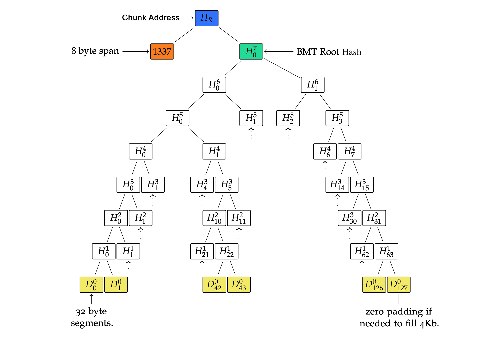
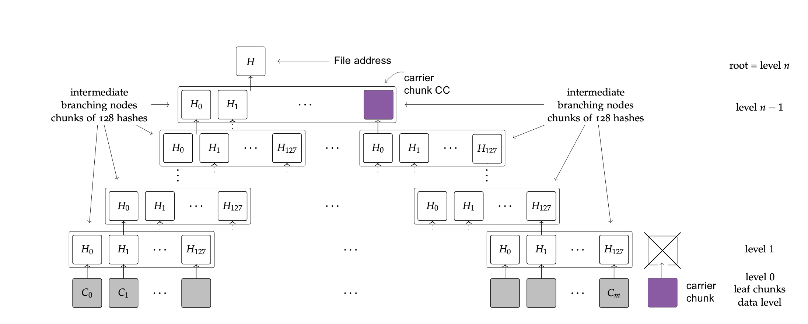
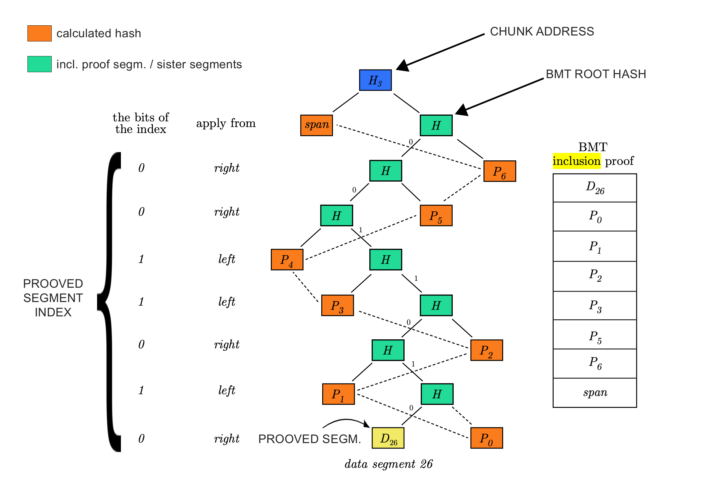

# BMT-JS

This JavaScript library does [Binary Merkle Tree](https://en.wikipedia.org/wiki/Merkle_tree) (BMT) operations on data.

The library calculates the content address of any data and also offers functions for performing cheap compact inclusion proof of any 32 bytes segments in it.

# Install

```sh
npm install @fairdatasociety/bmt-js --save
```

# How it works

First, it splits the data into `chunks` that have maximum 4KB payload by default, but this condition can modified as well as its `span` byte length (8 bytes) that indicates how long byte payload subsumed under the chunk.

If the payload byte length cannot fit exactly to this chunk division, the rightmost chunk's data will be padded with zeros in order to have fixed length data for the BMT operations.

This basic unit is also required to effectively distribute data on decentralized storage systems with regard to _plausible deniability_, _garbage collection_, _load balancing_ and else. 
For more details, please visit [Etherem Swarm]() webpage that has full implementation of this logic.

The used hashing algorithm is the `keccak256` function that results in a 32 bytes long `segment`.

Performing BMT hashing on the chunk data will define the `BMT root hash` of the chunk.
Then, for integrity considerations, the BMT root hash is hashed with the chunk's span from the left which takes the `Chunk address`.



In order to refer files also with a single 32 byte segment, the chunk addresses of the payload have to be hashed in the same way until the `File address`:

chunks can encapsulate 128 chunk addresses on the subsequent BMT tree level by default. These kind of chunks are called `Intermediate chunks`
By the properties of a BMT tree, the chunks will end in a `Root chunk` that refers all chunks below (directly or indirectly) and its address will be the `File address` as well.

One can realize, the BMT levels can have an orphan chunk on the rightmost-side that cannot be hashed with a neighbour chunk, because it does not have a neighbour chunk (e.g. 129/129 chunk).
When it occurs, it does not have a sense to hash this orphan chunk on every BMT level since it will be BMT hashed with zero data.
That's why the the algorithm handles orphan chunk as `Carrier chunk` and tries to place it into that BMT tree level where the chunk address can be encapsulated with other addresses.

This BMT hashing of data allows to reference any file with unified 32 bytes unique address which is called _content addressing_.



Nevertheless, it also allows to perform lightweight _compact inclusion proof_ on data.
This proof requires little amount of data to be provided for proving whether any particular segment (32 bytes) of the data is present at a particular offset under the file address.

This feature allows to create a logic around data referenced by 32 bytes file addresses where the data segment values have to meet some conditions.
The first/best use-case for this can happen via smart contracts that implement the validation functions that check the provided `inclusion proof segments` are indeed subsumed under the commited file references.

To get these inclusion segments, the library collects all required segments from the BMT tree that can be used for input of smart contract validation parameters.



# API

You can import the followings directly from `@fairdatasociety/bmt-js`:

## Types

* Chunk                           # interface of the helper object for performing BMT actions on chunk data
  * payload                       # the passed byte payload with which the object was initialized.
  * maxPayloadLength              # the maximum payload byte length in the chunk. It is 4096 by default. 
  * spanLength                    # the reserved byte length for span serialisation. By default it is 8 bytes.
  * data()                        # gives back the chunk's data that is exactly `maxPayloadLength` long
  * span()                        # serialized span value of chunk
  * address()                     # gives back the calculated chunk address of the data
  * inclusionProof(segmentIndex)  # gives back the inclusion proof segments for proofing the segment under the given index.
  * bmt()                         # gives back the Binary Merkle Tree of the chunk data
* ChunkedFile                     # interface of the helper object for performing BMT actions on file data
  * payload                       # the passed byte payload with which the object was initialized.
  * leafChunks()                  # data chunks of the file data
  * rootChunk()                   # topmost chunk in the file BMT
  * address()                     # gives back the calculated chunk address of file data
  * span()                        # serialized span value of the file
  * bmt()                         # gives back the Binary Merkle Tree of the file data
* ChunkInclusionProof             # groups chunk inclusion proof segments and span value of a chunk
* ChunkAddress                    # chunk address resulted from BMT hashing of data. It is used also fole FileAddress
* Span                            # span value in byte format. Indicates how much data subsumed under the Chunk/File

## Functions

* makeChunkedFile                 # makes `Chunk` helper object for performing BMT actions on file data
* makeChunk                       # makes `Chunk` helper object for performing BMT actions on chunk data
* makeSpan                        # make serialized `Span` byte array that indicates how much data subsumed under the Chunk/File
* getSpanValue                    # deserialised data into `number` carrier by `Span`
* rootHashFromInclusionProof      # calculate the BMT root hash from the provided inclusion proof segments and its corresponding segment index
* getBmtIndexOfSegment            # get the chunk's position of a given payload segment index in the BMT tree
* fileInclusionProofBottomUp      # gives back required sister segments of a given payload segment index for inclusion proof
* fileAddressFromInclusionProof   # gives back the file address that is calculated with only the inclusion proof segments and the corresponding proved segment and its position.

## Other objects

* Utils                           # mainly bytes related utility functions

# Compilation

In order to compile code run

```sh
npm run compile
```

You can find the resulted code under the `dist` folder.

For types compilation, run

```sh
npm run compile:types
```

# Testing

The testing needs running Bee client node for integration testing.
You can set `BEE_POSTAGE` environment variable with a valid Postage batch or the test will create one for you.

The default value of the Bee Debug API endpoint is `http://localhost:1635`. 
If your address diverges from that, please, set `BEE_DEBUG_API_URL` system environment variable with yours.

To run test execute

```sh
npm run test
```
